#                    Artwork Inventory Manager

## -  Project Description -
Java Swing application that manages an artwork collection.  
It stores information about artworks including ID, title, artist, year, location, and type (Painting or Sculpture).

---

## - Author
Sydygaalieva Zhasmin

---

##  - Objectives
- Manage artwork records (CRUD operations)
- Provide a simple GUI using Java Swing
- Store data in files for persistence
- Allow import/export of data
- Demonstrate OOP principles (Encapsulation, Inheritance, Polymorphism)

---

## - Features

### CRUD Operations
- Add artwork
- View artwork list
- Update artwork
- Delete artwork

### GUI
- Built using Java Swing
- Simple user-friendly interface

###  Data Types
- Painting
- Sculpture

###  File Support
- Export data to file
- Import data from file

---

## - OOP Concepts
- Encapsulation (private fields + getters/setters)
- Inheritance (Artwork - Painting, Sculpture)
- Polymorphism (method overriding)

---
## - Documentation

### Project Structure
- Main.java - run
- GUI.java - user interface (Swing)
- Artwork.java - base class
- Painting.java - child class (inheritance)
- Sculpture.java - child class (inheritance)
- User.java - child class (inheritance)
- ArtworkService.java - logic (CRUD operations)
- AuthService.java - login system
- DBconnection.java - connects to the database
- InitDB.java - creates table SQlite
- FileStorage.java - saving data to cvs files (export/import)

---

### How the program works
1. Creating table in InitDB
2. Run the program in Main class 
3. User logs in (Admin/User)
4. User can add and view artwork (ID, title, artist, year, location, type)
5. Data is displayed in text area 
6. Admin can update or delete records 
7. Data is saved to file and loaded again

---

### Error handling
- Invalid input is caught using try-catch
- Empty fields are validated before saving
- Wrong ID handling prevents crashes
---

##  Screenshots

all screen, with time, day

add
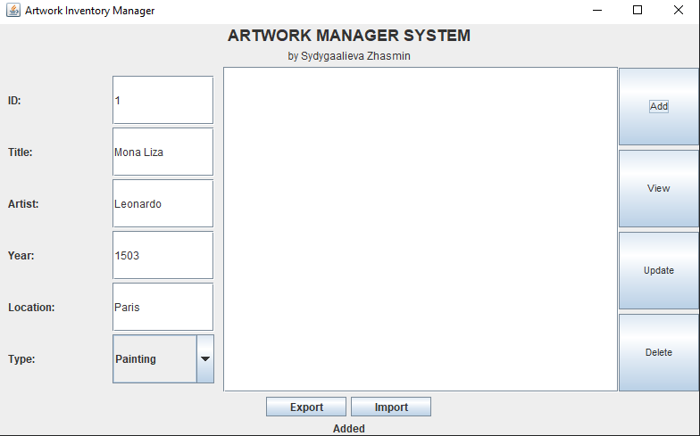

after we press view to see changes
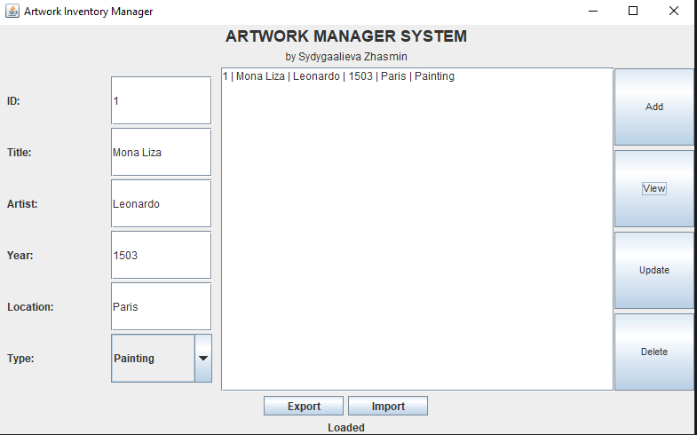

after we are updating our information
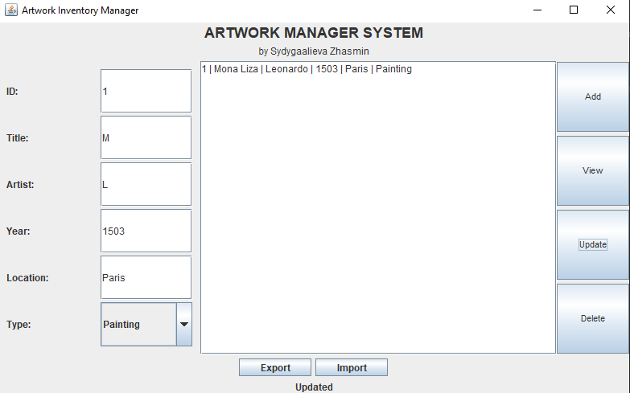

and press view to see changes
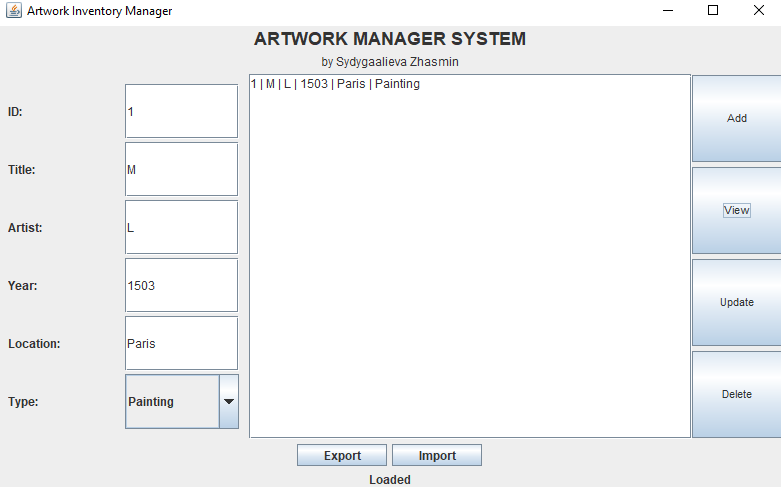

checking delete 
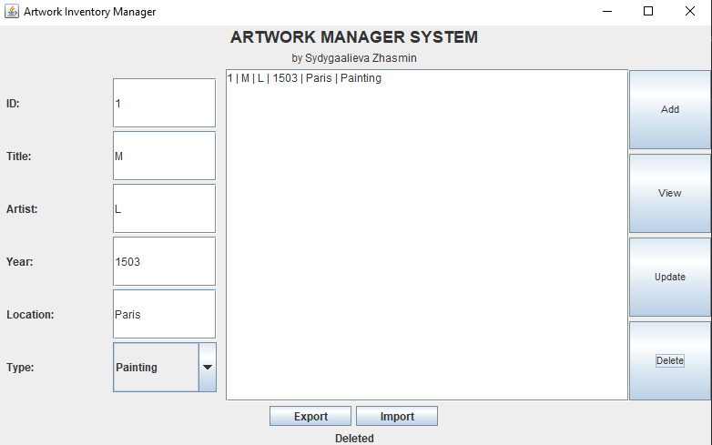

view to see changes, and we see that its deleted
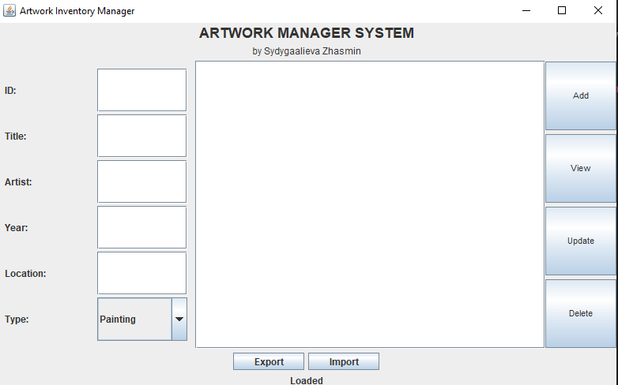

export
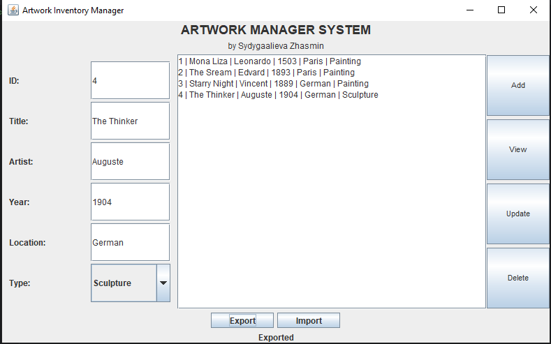
 
when I press export, all information saves in file csv
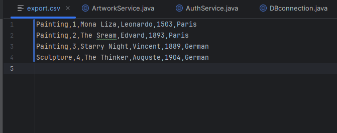

we're deleting all info, and reruning the program 
There is no information when I press view

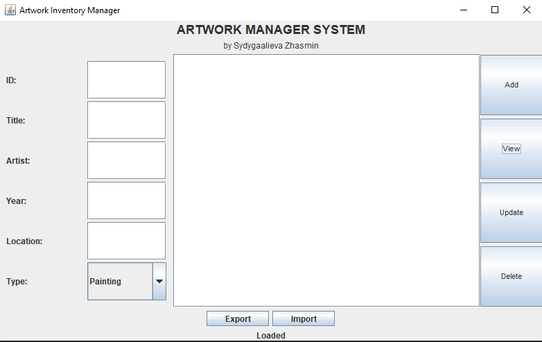

we press import
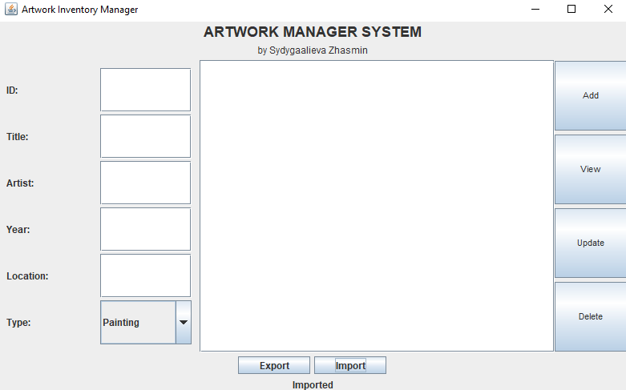

after we press view to see changes, and we that information was imported
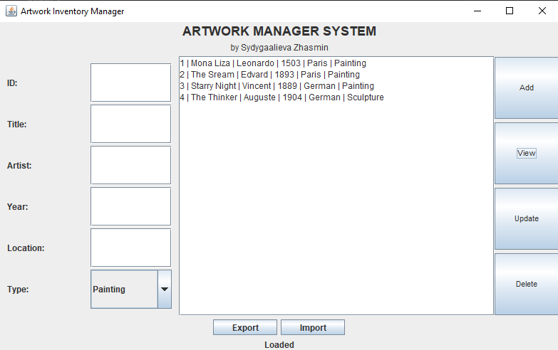