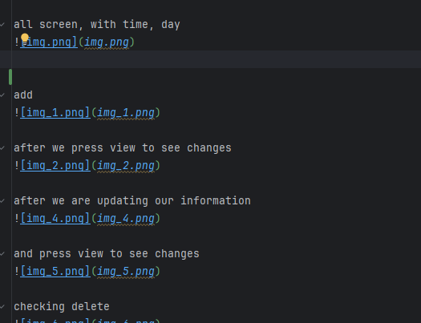

#                    Artwork Inventory Manager

## -  Project Description -
A simple Java Swing application that manages an artwork collection.  
It stores information about artworks including ID, title, artist, year, location, and type (Painting or Sculpture).

---

## - Author
Sydygaalieva Zhasmin

---

##  - Objectives
- Manage artwork records (CRUD operations)
- Provide a simple GUI using Java Swing
- Store data in files for persistence
- Allow import/export of data
- Demonstrate OOP principles (Encapsulation, Inheritance, Polymorphism)

---

## - Features

### CRUD Operations
- Add artwork
- View artwork list
- Update artwork
- Delete artwork

### GUI
- Built using Java Swing
- Simple user-friendly interface

###  Data Types
- Painting
- Sculpture

###  File Support
- Export data to file
- Import data from file

---

## - OOP Concepts
- Encapsulation (private fields + getters/setters)
- Inheritance (Artwork - Painting, Sculpture)
- Polymorphism (method overriding)

---
## - Documentation

### Project Structure
- GUI.java - user interface (Swing)
- Artwork.java - base class
- Painting.java - child class (inheritance)
- Sculpture.java - child class (inheritance)
- ArtworkService.java - logic (CRUD operations)
- AuthService.java - login system

---

### How the program works
1. User logs in (Admin/User)
2. User can add and view artwork (ID, title, artist, year, location, type)
3. Data is displayed in text area
4. Admin can update or delete records
5. Data is saved to file and loaded again

---

### Error handling
- Invalid input is caught using try-catch
- Empty fields are validated before saving
- Wrong ID handling prevents crashes
---

##  Screenshots

all screen, with time, day

add

after we press view to see changes

after we are updating our information

and press view to see changes

checking delete 

view to see changes, and we see that its deleted

export

import

